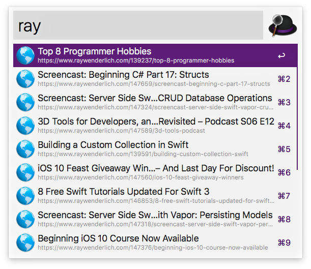

# Alfred workflow for getting raywenderlich.com feed([Download](https://github.com/softdevstory/alfred-workflows/blob/master/raywenderlich/raywenderlich.alfredworkflow))

Display the recent ariticles from [raywenderlich.com](https://www.raywenderlich.com)



# Usage

```
 ray
```

# Used Libraies

* [feedparser](https://github.com/kurtmckee/feedparser)
* [alfred-workflow](https://github.com/deanishe/alfred-workflow)