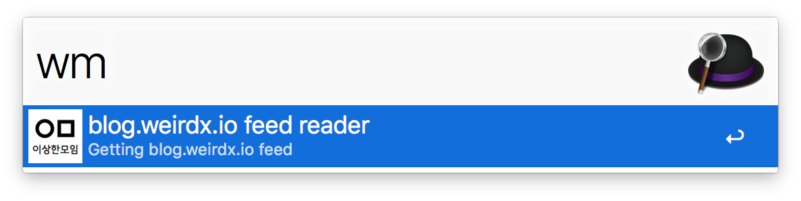
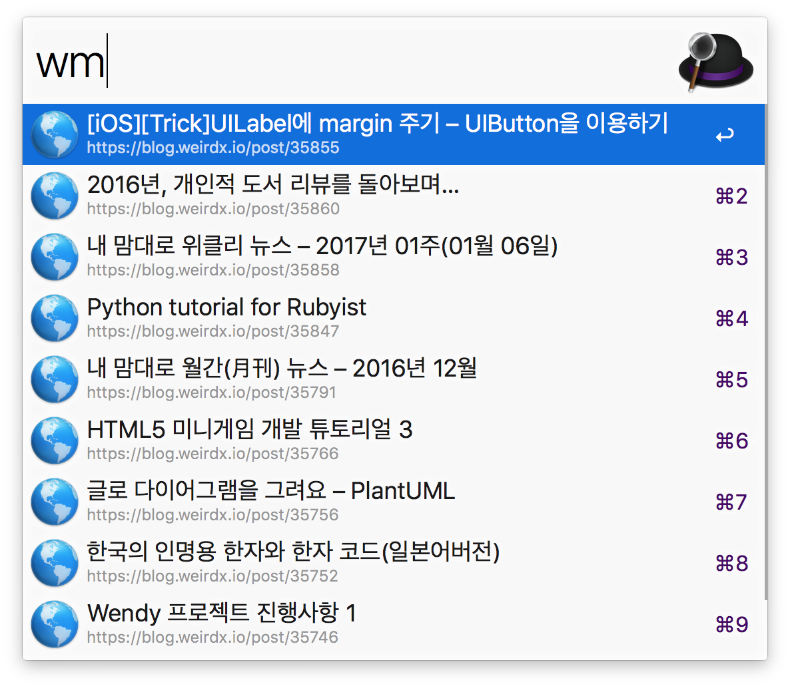

# 이상한모임 블로그 RSS 리더([Download](https://github.com/softdevstory/alfred-workflows/raw/master/weiredmeetup/WeiredMeetup.alfredworkflow))

[이상한 모임 블로그](http://blog.weiredx.io)의 최신 글을 보여주고, 선택하면 웹브라우저에서 해당 글을 보여줍니다.





# Usage

```
 wm
```

# Used Libraies

* [feedparser](https://github.com/kurtmckee/feedparser)
* [alfred-workflow](https://github.com/deanishe/alfred-workflow)
